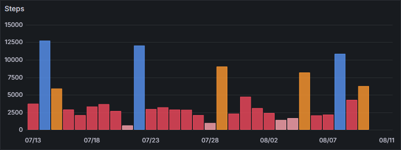

## About The Project

I wanted to store and keep history of my scanwatch data in influxdb which is a nice and easy database to use with Grafana.

You could use the withings API, but it doesn't look really simple to use with the oauth system.

It's my first CLI app using GO. I choose this language to learn it, and it seems suitable for creating CLI app.

### Built With

- GO
- InfluxDB

## Grafana example



### Query

Total per day.

```sql
from(bucket: "withings")
  |> range(start: v.timeRangeStart, stop: v.timeRangeStop)
  |> filter(fn: (r) => r["_measurement"] == "steps")
  |> filter(fn: (r) => r["_field"] == "count")
  |> filter(fn: (r) => r["device"] == "scanwatch")
  |> aggregateWindow(every: 1d, fn: sum)
  |> yield(name: "total_steps")
```

## Getting Started

### Prerequisites

You need to retrieve withings data: https://support.withings.com/hc/en-us/articles/360001394948-Withings-App-Android-Downloading-my-data

You will receive an email, extract the archive and get the path of the folder

You also need an InfluxDB API endpoint available.

### Installation

- Clone

```bash
git clone https://github.com/baptistebisson/withings-to-influxdb.git
```

- Setup env

```bash
cd withings-to-influxdb && cp .env.example .env
```

- Run it

```bash
go run main.go --folder=/path/to/withings/export
```

## Withings doc

`raw_tracker_steps.csv`: Steps data

- Duration : (seconds)
- Value : (steps number)

`sleep.csv`: Sleep data

`raw_tracker_distance.csv`: Distance data

- Duration : (seconds)
- Value : (meters)